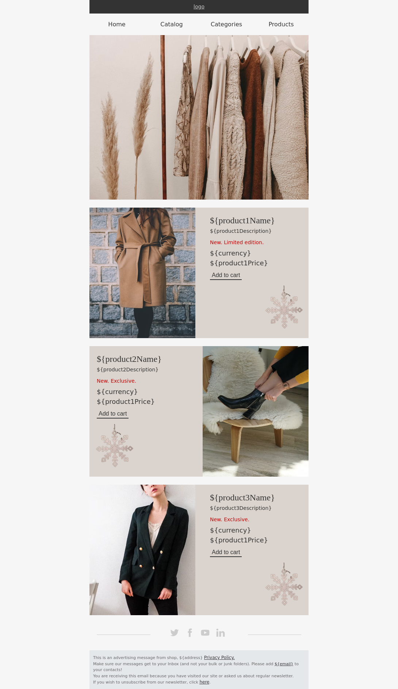
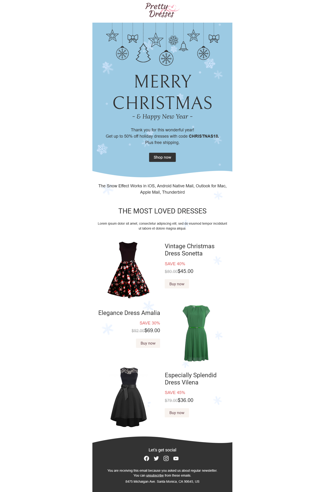

# email_marketing_templates

### contribution guidelines 
* you have to create folder in root dir of repo with the name of template
* all dependent images should be present in the folder
* their should be .txt file for the template representing which properties are required by the template
* its good if you create one minified file and test it once before pushing

### templates
| screenshot                                                      | name                                           |
| --------------------------------------------------------------- | ---------------------------------------------- |
|  | [Autumn is on the way](./autumn-is-on-the-way) |
|    | [New year snow queen](./new-year-snow-queen)   |
|       | [Women's day offers](./womens-day-offers)      |
|          | [Christmas sale](./christmas-offers/)          |
|                                                                 |                                                |
|                                                                 |                                                |
|                                                                 |                                                |
|                                                                 |                                                |
|                                                                 |                                                |
|                                                                 |                                                |